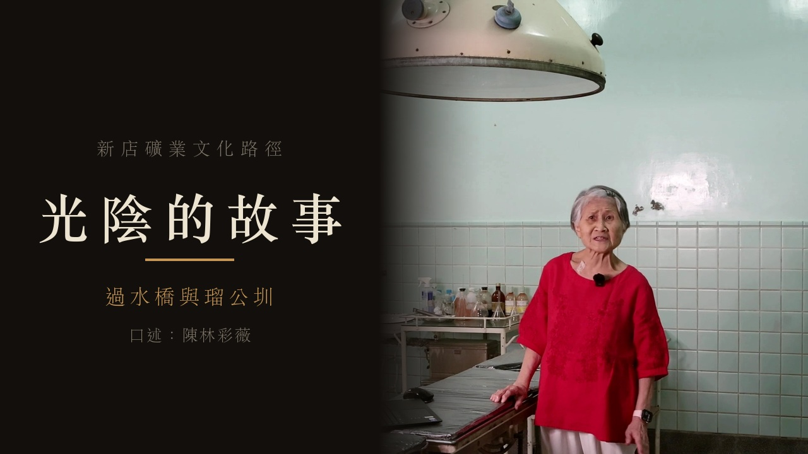
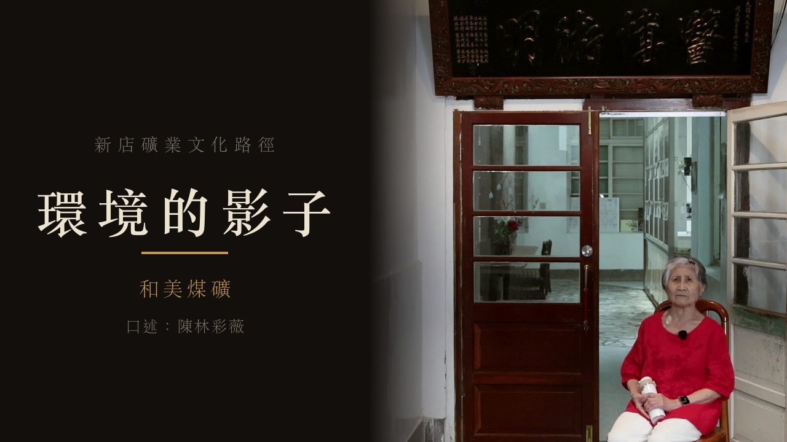
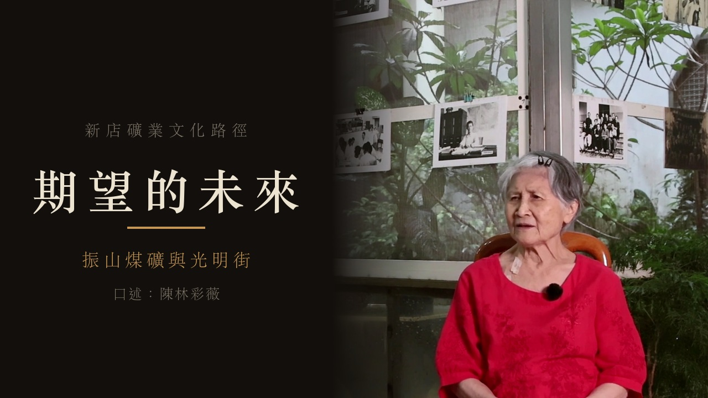

# 新店礦業文化路徑 導覽影片

A series of Mandarin-language explainer videos produced for a QR-code
self-guided heritage tour along the Xindian mining heritage trail, on behalf
of 新北市陳昌梯醫師山林保育協會 with funding from the 新北市文化局 community
grant program. Visitors scan a QR code at each physical trail point to watch
the corresponding video.

## Watch

<table>
<tr>
<td width="33%"> <b><a href="https://youtu.be/8XRNyy2YZLI">光陰的故事（過水橋與瑠公圳）</a></b> — 3:52</td>
<td width="33%"> <b><a href="https://youtu.be/7xoPL_1h3pg">環境的影子（和美煤礦）</a></b> — 3:15</td>
<td width="33%"> <b><a href="https://youtu.be/4zpehkFpT30">期望的未來（振山煤礦與光明街）</a></b> — 2:53</td>
</tr>
</table>

A standalone behind-the-scenes video was planned but not pursued; BTS material was instead incorporated into the end of each of the three videos above.

## Trail posters

Printable A4 posters for each trail point, with a QR code linking to the corresponding video. Click a preview to open the full-resolution print PDF.

<table>
<tr>
<td width="25%"></td>
<td width="25%"></td>
<td width="25%"></td>
<td width="25%"></td>
</tr>
</table>

## Credits

| Role | Name |
|---|---|
| 口述 (Narrator) | 陳林彩薇（林秀卿先生之女） |
| 攝影 (Cinematography) | 李承洋 |
| 後製剪輯 (Post-production) | 楊大謙 |
| 指導單位 (Supervising organization) | 新北市政府文化局 |
| 執行單位 (Executing organization) | 新北市陳昌梯醫師山林保育協會 |

## Repository contents

This repository documents the editorial process behind the videos: cut
decisions, transcripts, subtitles, and the scripts used to generate titles,
posters, and the final export. See `edit/project.md` for the production
log and `edit/WORKLOG.md` for the revision history.

## License

All rights reserved. Video content and footage are the property of
新北市陳昌梯醫師山林保育協會 and the production team.

## Tooling

Edited with [video-use](https://github.com/browser-use/video-use), an
open-source conversation-driven video editor by [Browser Use](https://github.com/browser-use).
